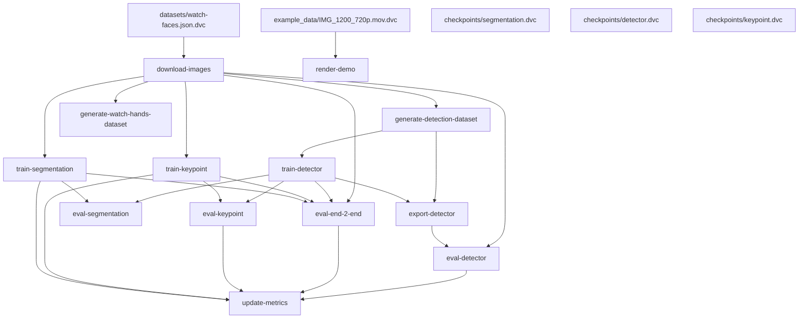

# Demo

 
 
 


https://user-images.githubusercontent.com/17779555/229043335-a8e01496-0235-45c9-b5a4-e6227abd8c57.mp4

models used:
- bbox detector for finding clock face in the image
- classifier for clock orientation estimation
- keypoint detection for center and top
- semantic segmentation for finding clock hands
- KDE for splitting the binary segmentation mask into individual clock hands
### Watch crop with center and top keypoint

### Detected mask of watch hands

### KDE of pixel angles

### Fitted lines to segmented pixels

### Final selected and rejected lines


# Metrics
| Path                           | val.1-min_acc   | val.10-min_acc   | val.60-min_acc   |
|--------------------------------|-----------------|------------------|------------------|
| metrics/end_2_end_summary.json | 0.224           | 0.345            | 0.414            |

| Path   |
|--------|

| Path   |
|--------|

| Path                      | eval.iou_score   | eval.loss   | step   | train.iou_score   | train.loss   |
|---------------------------|------------------|-------------|--------|-------------------|--------------|
| metrics/segmentation.json | 0.585            | 0.262       | 149    | 0.851             | 0.081        |

# Graph

# Installation
Install `watch_recognition` module, run pip in the main repository dir
```bash
pip install watch_recognition/
```
Tested on Python 3.7 and 3.8
## Running models
Checkout example notebook: `notebooks/demo-on-examples.ipynb`
## Models description
_TODO_
