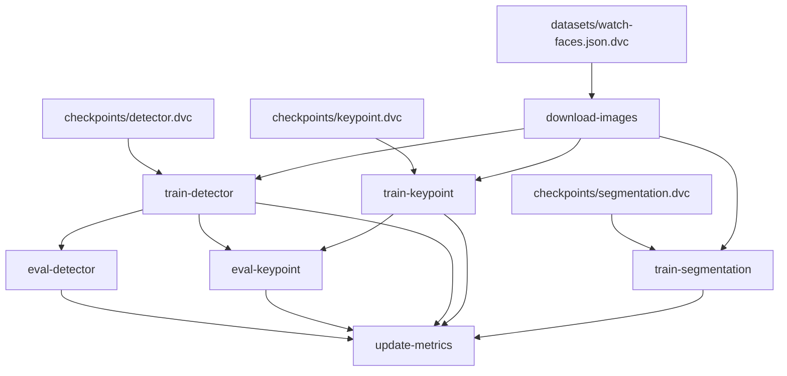

# Metrics
| Path                             | AP @IoU=0.50   | AP @IoU=0.50:0.95   | AP @IoU=0.75   | AP @IoU=0.95   | AR @IoU=0.50   | AR @IoU=0.50:0.95   | AR @IoU=0.75   | AR @maxDets=1   | AR @maxDets=10   | AR @maxDets=100   | Num Images   | eval.iou_score   | eval.loss   | step   | train.iou_score   | train.loss   |
|----------------------------------|----------------|---------------------|----------------|----------------|----------------|---------------------|----------------|-----------------|------------------|-------------------|--------------|------------------|-------------|--------|-------------------|--------------|
| metrics/detector.json            | -              | -                   | -              | -              | -              | -                   | -              | -               | -                | -                 | -            | -                | 0.2488      | 49     | -                 | 0.0087       |
| metrics/detector/coco_train.json | 0.4236         | 0.3206              | 0.39112        | -1.0           | -              | -                   | -              | 0.43167         | 0.4625           | 0.4625            | 127          | -                | -           | -      | -                 | -            |
| metrics/detector/coco_val.json   | 1.0            | 0.77475             | 1.0            | -1.0           | -              | -                   | -              | 0.78333         | 0.78333          | 0.78333           | 6            | -                | -           | -      | -                 | -            |
| metrics/keypoint.json            | -              | -                   | -              | -              | -              | -                   | -              | -               | -                | -                 | -            | 0.58531          | 0.41469     | 24     | 0.76826           | 0.23865      |
| metrics/keypoint/coco_train.json | 0.31264        | 0.22896             | 0.18343        | -              | 0.50833        | 0.40583             | 0.35           | -               | -                | -                 | 127          | -                | -           | -      | -                 | -            |
| metrics/keypoint/coco_val.json   | 0.77723        | 0.36812             | 0.13465        | -              | 0.83333        | 0.48333             | 0.33333        | -               | -                | -                 | 6            | -                | -           | -      | -                 | -            |
| metrics/segmentation.json        | -              | -                   | -              | -              | -              | -                   | -              | -               | -                | -                 | -            | 0.36534          | 0.46483     | 24     | 0.78224           | 0.1082       |


# Demo - version 2

 

 


https://user-images.githubusercontent.com/17779555/151705227-a892424b-279c-4a43-9076-494a55717d0c.mov

models used:
- bbox detector for finding clock face in the image
- classifier for clock orientation estimation
- keypoint detection for center and top
- semantic segmentation for finding clock hands
- KDE for splitting the binary segmentation mask into individual clock hands
### Watch crop with center and top keypoint

### Detected mask of watch hands

### KDE of pixel angles

### Fitted lines to segmented pixels

### Final selected and rejected lines


## Installation
Install `watch_recognition` module, run pip in the main repository dir
```bash
pip install watch_recognition/
```
Tested on Python 3.7 and 3.8
## Running models
Checkout example notebook: `notebooks/demo-on-examples.ipynb`
## Models description
_TODO_

# Demo - version 1

https://user-images.githubusercontent.com/17779555/136506927-d326381b-6d54-4c2a-91a8-aa0fee89ba36.mov

models used:
- bbox detector for finding clock face in the image
- classifier for clock orientation
- keypoint detection for center, top and end of clock hands

# Downloading images from OpenImage Dataset

```bash
wget https://raw.githubusercontent.com/openimages/dataset/master/downloader.py
```

```bash
python scripts/downloader.py ./download_data/train_ids_small.txt --download_folder=./download_data/train/
```

```bash
python scripts/downloader.py ./download_data/test_ids_small.txt --download_folder=./download_data/test/
```

```bash
python scripts/downloader.py ./download_data/validation_ids_small.txt --download_folder=./download_data/validation/
```
# Convert tagged data into keypoint dataset

see notebook `./notebooks/generate_kp_dataset.ipynb`

# Train keypoint detection model
see notebook `./notebooks/cell-coder.ipynb.ipynb`

# Label Studio setup
https://labelstud.io/

```xml
<View>
    <Image name="image" value="$image" zoom="true" zoomControl="true"/>
      <KeyPointLabels name="kp" toName="image">
        <Label value="Center" background="#FFA39E"/>
        <Label value="Top" background="#D4380D"/>
        <Label value="Crown" background="#FFC069"/>
    </KeyPointLabels>
    <PolygonLabels name="polygon" toName="image" strokeWidth="3" pointSize="small" opacity="0.9">
        <Label value="Hands" background="#45fc03"/>
    </PolygonLabels>
    <RectangleLabels name="bbox" toName="image">
        <Label value="WatchFace" background="#FFA39E"/>
    </RectangleLabels>
      <TextArea name="transcription" toName="image" editable="true" perRegion="true" required="false" maxSubmissions="1" rows="5" placeholder="Recognized Time" displayMode="region-list"/>    
</View>
```
References 
1. OpenImagesDataset https://opensource.google/projects/open-images-dataset
