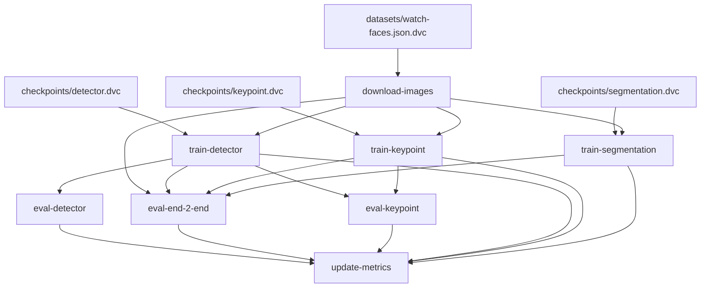

# Graph

# Metrics
| Path                           | train.1-min_acc   | train.10-min_acc   | train.60-min_acc   | val.1-min_acc   | val.10-min_acc   | val.60-min_acc   |
|--------------------------------|-------------------|--------------------|--------------------|-----------------|------------------|------------------|
| metrics/end_2_end_summary.json | 0.066             | 0.082              | 0.168              | 0.013           | 0.026            | 0.039            |

| Path                             | AP @IoU=0.50   | AP @IoU=0.50:0.95   | AP @IoU=0.75   | AP @IoU=0.95   | AR @maxDets=1   | AR @maxDets=10   | AR @maxDets=100   | Num Images   | eval.loss   | step   | train.loss   |
|----------------------------------|----------------|---------------------|----------------|----------------|-----------------|------------------|-------------------|--------------|-------------|--------|--------------|
| metrics/detector.json            | -              | -                   | -              | -              | -               | -                | -                 | -            | 0.42        | 59     | 0.041        |
| metrics/detector/coco_train.json | 0.459          | 0.327               | 0.403          | -1.0           | 0.42            | 0.455            | 0.455             | 127          | -           | -      | -            |
| metrics/detector/coco_val.json   | 1.0            | 0.73                | 0.832          | -1.0           | 0.75            | 0.75             | 0.75              | 6            | -           | -      | -            |

| Path                             | AP @IoU=0.50   | AP @IoU=0.50:0.95   | AP @IoU=0.75   | AR @IoU=0.50   | AR @IoU=0.50:0.95   | AR @IoU=0.75   | Num Images   | eval.iou_score   | eval.loss   | step   | train.iou_score   | train.loss   |
|----------------------------------|----------------|---------------------|----------------|----------------|---------------------|----------------|--------------|------------------|-------------|--------|-------------------|--------------|
| metrics/keypoint.json            | -              | -                   | -              | -              | -                   | -              | -            | 0.62             | 0.38        | 59     | 0.899             | 0.106        |
| metrics/keypoint/coco_train.json | 0.522          | 0.365               | 0.315          | 0.65           | 0.503               | 0.458          | 127          | -                | -           | -      | -                 | -            |
| metrics/keypoint/coco_val.json   | 1.0            | 0.754               | 0.632          | 1.0            | 0.783               | 0.667          | 6            | -                | -           | -      | -                 | -            |

| Path                      | eval.iou_score   | eval.loss   | step   | train.iou_score   | train.loss   |
|---------------------------|------------------|-------------|--------|-------------------|--------------|
| metrics/segmentation.json | 0.448            | 0.381       | 59     | 0.748             | 0.114        |

# Metrics definition
Final metric for the entire system is 'x-min accuracy' which is the fraction of system predictions accurate within x minutes. Example:  
$$ 1-min-acc = 1 - {|time - time_pred | < 1 min \over N_samples} $$
# Demo - version 2

 

 


https://user-images.githubusercontent.com/17779555/151705227-a892424b-279c-4a43-9076-494a55717d0c.mov

models used:
- bbox detector for finding clock face in the image
- classifier for clock orientation estimation
- keypoint detection for center and top
- semantic segmentation for finding clock hands
- KDE for splitting the binary segmentation mask into individual clock hands
### Watch crop with center and top keypoint

### Detected mask of watch hands

### KDE of pixel angles

### Fitted lines to segmented pixels

### Final selected and rejected lines


## Installation
Install `watch_recognition` module, run pip in the main repository dir
```bash
pip install watch_recognition/
```
Tested on Python 3.7 and 3.8
## Running models
Checkout example notebook: `notebooks/demo-on-examples.ipynb`
## Models description
_TODO_

# Demo - version 1

https://user-images.githubusercontent.com/17779555/136506927-d326381b-6d54-4c2a-91a8-aa0fee89ba36.mov

models used:
- bbox detector for finding clock face in the image
- classifier for clock orientation
- keypoint detection for center, top and end of clock hands

# Downloading images from OpenImage Dataset

```bash
wget https://raw.githubusercontent.com/openimages/dataset/master/downloader.py
```

```bash
python scripts/downloader.py ./download_data/train_ids_small.txt --download_folder=./download_data/train/
```

```bash
python scripts/downloader.py ./download_data/test_ids_small.txt --download_folder=./download_data/test/
```

```bash
python scripts/downloader.py ./download_data/validation_ids_small.txt --download_folder=./download_data/validation/
```
# Convert tagged data into keypoint dataset

see notebook `./notebooks/generate_kp_dataset.ipynb`

# Train keypoint detection model
see notebook `./notebooks/cell-coder.ipynb.ipynb`

# Label Studio setup
https://labelstud.io/

```xml
<View>
    <Image name="image" value="$image" zoom="true" zoomControl="true"/>
      <KeyPointLabels name="kp" toName="image">
        <Label value="Center" background="#FFA39E"/>
        <Label value="Top" background="#D4380D"/>
        <Label value="Crown" background="#FFC069"/>
    </KeyPointLabels>
    <PolygonLabels name="polygon" toName="image" strokeWidth="3" pointSize="small" opacity="0.9">
        <Label value="Hands" background="#45fc03"/>
    </PolygonLabels>
    <RectangleLabels name="bbox" toName="image">
        <Label value="WatchFace" background="#FFA39E"/>
    </RectangleLabels>
      <TextArea name="transcription" toName="image" editable="true" perRegion="true" required="false" maxSubmissions="1" rows="5" placeholder="Recognized Time" displayMode="region-list"/>    
</View>
```
References 
1. OpenImagesDataset https://opensource.google/projects/open-images-dataset
